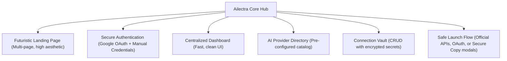
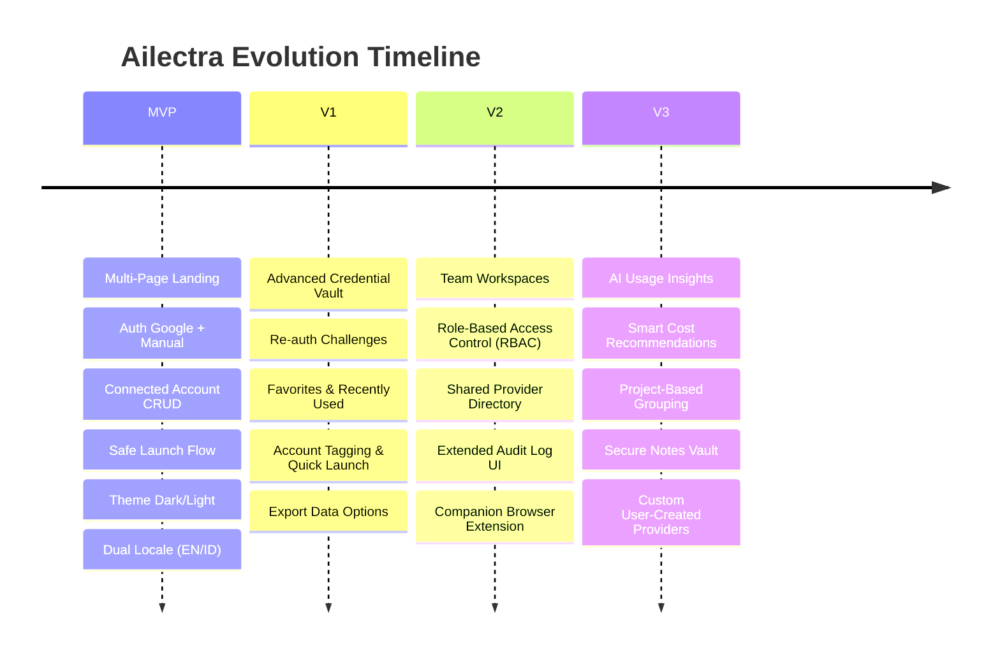
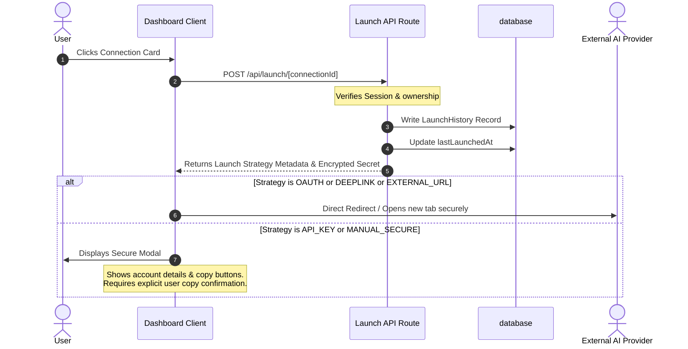
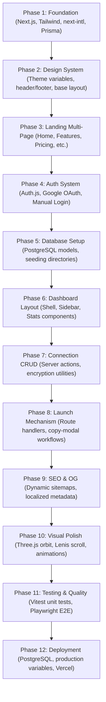

# Ailectra Product Planning Summary

This document provides a comprehensive synthesis of Ailectra's product planning documents: `prd.md`, `roadmap.md`, and `implementation-plan.md`. It outlines the core product scope, MVP boundaries, step-by-step user flows, and clear acceptance criteria for development.

---

## 1. Product Vision & Scope

**Ailectra** is a futuristic, highly performant **AI Account Access Hub** designed for power users, developers, freelancers, and creators who manage multiple AI services and accounts. It offers a visually stunning, responsive space where users can centralize, secure, and launch their accounts seamlessly.

> **Brand Identity:** Ailectra — One Access for Every AI
> **Default Theme:** Dark Mode (visually rich, modern, aesthetic)
> **Default Language:** English (with built-in Indonesian i18n support)

### Core Scope Goals

#### Pre-Configured Directory Providers
The initial directory contains 11 preset AI providers with categorization and metadata:
*   **Coding & Dev:** Cursor, V0, Bolt, Replit AI, Lovable
*   **General Purpose:** ChatGPT, Claude, Gemini, Grok, DeepSeek
*   **Search & Research:** Perplexity

---

## 2. MVP Boundaries

To deliver a high-quality product swiftly, the boundaries of the Minimum Viable Product (MVP) are tightly defined against future versions.

### In-Scope vs. Out-of-Scope

| Category | In-Scope (MVP) | Out-of-Scope (V1 & Beyond) |
| :--- | :--- | :--- |
| **Authentication** | Google OAuth & manual email/password with hashing. Protected dashboard routing. | Biometrics, passkeys, enterprise SSO, team/shared workspace access controls. |
| **Data Vault** | Local server-side encryption/decryption using a secure `ENCRYPTION_KEY`. No plain-text secrets in DB. | Hardware Security Module (HSM), automated re-authentication challenge before revealing keys, export options. |
| **Provider Connection** | Basic CRUD operations for connection metadata (Label, Email/Username, Encrypted Secrets, Custom Notes). | Account tags, "Favorites" flagging, custom user-defined providers. |
| **Launch Mechanism** | Redirection via `/api/launch/[id]` + Audit Logs. Secure manual clipboard-modal fallback. | Browser extension companion, deep automatic page-filler (auto-login script hijacking). |
| **Analytics** | Basic launch counts, "Last Used" timestamp, and a paginated Launch History table. | Advanced usage insights, cost/token tracking, AI-powered usage recommendations. |

### Feature Roadmap Progression

---

## 3. Core User Flows

### 3.1 Public Marketing Flow
1. **Discovery:** User lands on the home page (`/`) and experiences premium visuals (Three.js AI orbit space, smooth Lenis scroll, fluid dark gradients).
2. **Navigation:** User browses subpages to understand features, pricing structures, integration listings, and security standards:
   *   `/features` — Interactive feature bento grid.
   *   `/integrations` — Supported AI directory showcase.
   *   `/security` — Detailing vault encryption algorithms.
   *   `/pricing` — Tier presentation.
   *   `/about` & `/contact` — Company info and feedback form.
3. **CTA Entry:** User clicks "Get Started" and is redirected to `/login` or `/register`.

### 3.2 Authentication & Onboarding Flow
1. **Method Selection:** The user registers or signs in using **Google OAuth** or **Manual Credentials** (validated via Zod).
2. **First-Time Welcome:** Upon the first successful authentication, the user completes a brief onboarding tour summarizing dashboard functionality.
3. **Redirection:** Successful sessions forward directly to `/dashboard`. Unauthenticated access attempts are bounced back by Next.js middleware with localized error handling.

### 3.3 Connection Management (CRUD) Flow
1. **Catalog Browsing:** From the dashboard, the user opens the AI Directory to pick a provider (e.g., Lovable).
2. **Connection Form:** User enters connection parameters:
   *   **Label** (e.g., "Personal Project AI", "Work Cursor Account")
   *   **Email/Username**
   *   **Secret/Token/Password** (Encrypted in the background before database storage)
   *   **Custom Notes** (e.g., billing details, usage guidelines)
3. **Vault Safe Keeping:** The system securely commits the record, registering it under the authenticated user.
4. **List Display:** The connection appears as a card on the dashboard with category badges and custom preference colors.

### 3.4 Safe Launch Flow
The launch mechanism protects credentials and ensures compliance with external Terms of Service.

#### Detailed Launch Type Strategies
1.  **`OFFICIAL_OAUTH`**: Directs to the provider’s official authentication portal.
2.  **`DEEPLINK`**: Seamlessly opens specific native apps or application routes where supported.
3.  **`EXTERNAL_URL`**: Launches the web address of the AI provider in a safe target window with `rel="noopener noreferrer"`.
4.  **`API_KEY` / `MANUAL_SECURE`**: Fallback strategy for services without programmatic single sign-on. Renders a secure, high-contrast modal displaying account identifiers with easy-copy handlers. Raw secrets are kept hidden until the user triggers a visible "Reveal" action or clicks "Copy," with clear security warnings provided.

---

## 4. Technical Implementation Phases

The project will proceed through 12 organized execution phases as laid out in the implementation plan:

---

## 5. Acceptance Criteria (Definition of Done)

To consider the MVP successfully delivered, the codebase must fulfill all elements of the following criteria:

### Functional Performance Criteria
*   **Authentication Validation:** Registration, manual login, and Google OAuth must authenticate smoothly. Attempting to enter `/dashboard` without an active session must trigger a redirect back to `/login`.
*   **Security Vault Standards:**
    *   No secret (passwords, tokens, keys) must be stored in plaintext. They must be encrypted via standard cryptological utilities (e.g., `AES-256-GCM` or `crypto` module utilizing the `ENCRYPTION_KEY`).
    *   Secrets must never leak in client console outputs, database log queries, or unencrypted responses.
*   **CRUD Verification:** Users must be able to create, view, edit, and delete connections. Database records must be isolated; a user must never be able to view, edit, or delete another user's connections (strict query filters on `userId`).
*   **Launch Loop:** Clicking a connection card must write an entry to the `LaunchHistory` table, update the `lastLaunchedAt` timestamp, and execute the correct redirect or launch modal.
*   **Localization (i18n):** Users must be able to switch between English and Indonesian layouts. Alternates headers must be present in the HTML DOM for optimal search indexing.

### Technical & Quality Standards
*   **Aesthetic Quality:** Ailectra must feature high-end aesthetics (harmony of modern colors, responsive layout, fluid hover transitions, background overlay isolate structure, and micro-interactions).
*   **Code Integrity:** Strict TypeScript configurations must pass (`tsc --noEmit`). No hydration warnings or unhandled console errors should be present.
*   **Responsive UI:** Complete layouts must fit cleanly on desktop, tablet, and mobile breakpoints without experiencing vertical layout shifts or horizontal overflows.
*   **SEO & OG Verification:**
    *   Descriptive tags, unique headings (`<h1>` rules), and structured JSON-LD data must be embedded.
    *   Sitemap (`sitemap.xml`) and dynamic OG images (`/opengraph-image`) must resolve properly.
*   **Performance Benchmarks:** High scores on Lighthouse performance tests, achieved through optimized component loading, font streaming, and lightweight background canvases.

---

## 6. Planning Recommendations & Open Questions

> [!NOTE]
> Reviewing the security architectural files highlights the necessity of strict secret lifecycle management.

### Key Architectural Decisions for Your Review:
1.  **Secret Decryption Trigger:** How should we structure the credentials display in the `/dashboard/security` settings or launch modals? We recommend a strict "Reveal" interaction that prompts the user or demands confirmation before decrypting.
2.  **Next-Intl Routing Strategy:** For clean multi-language routing, the implementation plan adopts the `[locale]` dynamic routing path. This requires keeping routing structures nested neatly within the `/src/app/[locale]` folder.
3.  **Local Encryption Strategy:** To run locally, we must generate and supply a 32-byte Base64 key for `ENCRYPTION_KEY` in the `.env` file before executing credentials encryption routines.
